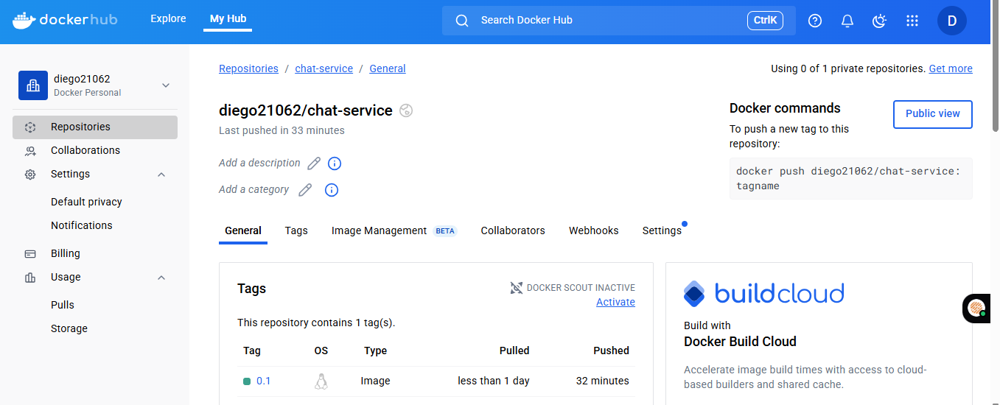
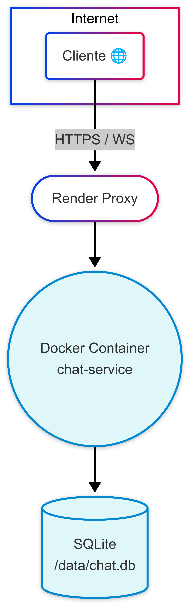
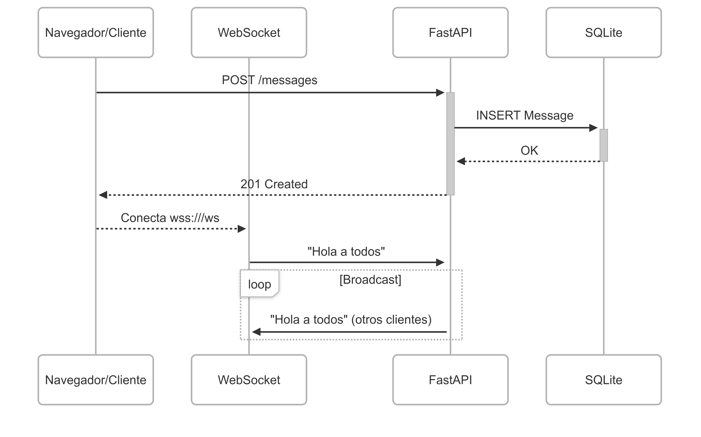
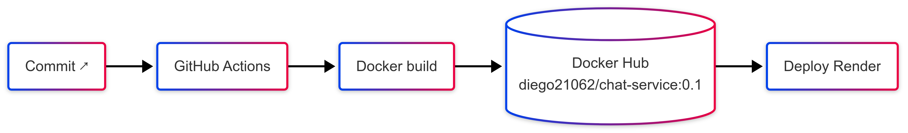

# Chat‑as‑a‑Service (SaaS Demo)

***Laboratorio de Ingeniería de Software Distribuido***


> Despliegue público: **[https://chat-service-0-1.onrender.com](https://chat-service-0-1.onrender.com)**
> Docker Hub (imagen pública): **diego21062/chat-service:0.1**

> 

---
## 📝 Resumen

**Chat-as-a-Service (Ca-a-S)** es un micro-servicio construido con **FastAPI** que brinda mensajería en tiempo real a través de **WebSockets** y una API **REST** para almacenar el historial. Se empaqueta en un único contenedor **Docker** y se despliega como **SaaS** en Render Free (o cualquier plataforma compatible).

| Aspecto | Detalle |
|---------|---------|
| **Modelo SaaS** | *Zero-Ops*: sin administrar servidores.<br>*Pay-per-use*: Render suspende la instancia sin tráfico.<br>HTTPS/WSS y TLS gestionados por el proveedor. |
| **Funcionalidades clave** | 1. Persistencia ligera en **SQLite**.<br>2. Historial inicial + **broadcast** en vivo.<br>3. Patrones distribuidos: micro-servicio stateless, balanceo global y CI/CD (GitHub Actions → Docker Hub → Render). |
| **Por qué WebSockets** | Necesitamos *push* instantáneo; evita el *polling* HTTP.<br>Conexión dúplex duradera ⇒ menor latencia y cabecera.<br>Modelo publicación-suscripción simple para múltiples clientes. |
| **Propósito docente** | Ilustrar sincronización, concurrencia y consistencia eventual mediante un ejemplo tangible y visual, listo para prácticas de **Sistemas Distribuidos** o prototipos de hackatón. |

> En conjunto, el proyecto muestra cómo construir, contenerizar y exponer un servicio de mensajería **SaaS-ready** con el mínimo esfuerzo operativo.

## ✨ ¿Por qué "Chat‑as‑a‑Service"?

| Rasgo                        | Explicación breve                                                                                       |
| ---------------------------- | ------------------------------------------------------------------------------------------------------- |
| **SaaS puro**                | El código corre en Render; tú no mantienes servidores ni SO. Pagas (o no) solo por los recursos usados. |
| **Stateless + DB ligera**    | El contenedor escala horizontalmente; la base SQLite vive dentro, suficiente para demos.                |
| **Protocolo en tiempo real** | WebSocket permite *push* instantáneo sin *polling*; vital para salas de chat, dashboards, juegos.       |
| **Caso académico**           | Reúne: concurrencia, consistencia, patrones distribuidos y CI/CD moderno.                               |

---

## 🌐 Arquitectura de alto nivel

<p align="center">
  <!-- imagen renderizada -->
  
</p>

### ¿Qué ocurre?

1. **Cliente** (navegador, Postman, IoT) se conecta por **HTTPS** (REST) o **WSS** (WebSocket) al *proxy* de Render.
2. El proxy balancea la petición a **tu contenedor Docker** (`chat-service`).
3. El contenedor ejecuta **FastAPI**:

   * Rutas REST: `POST /messages`, `GET /messages`.
   * Endpoint WebSocket: `/ws`.
4. Mensajes se guardan en **SQLite** (`/data/chat.db`).
5. Cuando un nuevo cliente se conecta, el servidor *push* los **20 últimos mensajes** y entra al ciclo de **broadcast**.

**Por qué es importante**

* **Escala horizontal**: Render lanza réplicas idénticas → balanceo L7.
* **Auto‑provisión**: sin VMs, sin kubectl. Render descarga tu imagen desde Docker Hub y la arranca.

---

## 🔄 Diagrama de secuencia (flujo lógico)

<p align="center">
  
</p>

1. El cliente crea (POST) un mensaje → FastAPI lo inserta y responde `201`.
2. El cliente abre WebSocket → servidor envía historial.
3. Cada mensaje nuevo se re‑envía a **todos** los clientes en la lista `active_clients`.

**Notas técnicas**

* Broadcasting se hace en memoria; ideal para prototipos.
* Re‑intento y cierre limpio (`finally: active_clients.remove`).

---

## 🚀 CI/CD — de *git push* a producción

<p align="center">
  
</p>

1. **Commit** en GitHub ⇒ **GitHub Actions** construye la imagen.
2. `docker push` a **Docker Hub** (`diego21062/chat-service`).
3. Workflow llama a **Render Deploy Hook** ⇒ Render descarga la imagen y crea nueva *revision*.
4. Tráfico se enruta al *deploy* más reciente tras pasar *health checks*.

---

## 🧑‍💻 Tech stack

| Capa          | Tecnología                   | Detalles                                                                     |
| ------------- | ---------------------------- | ---------------------------------------------------------------------------- |
| Lenguaje      | **Python 3.10**              | Compatibilidad amplia; upgrade fácil a 3.11.                                 |
| Framework     | **FastAPI**                  | Async, docs automáticas (Swagger UI).                                        |
| Base de datos | **SQLite 3**                 | Archivo local `/data/chat.db`; suficiente para laboratorio.                  |
| WebSocket lib | nativo FastAPI / `starlette` | *asyncio* + `await ws.send_text()`.                                          |
| Contenedor    | **python:3.10‑slim**         | Imagen ligera (< 50 MB).                                                     |
| Hosting       | **Render Free**              | *Cold start* \~30 s; suspensión tras 15 min sin tráfico; 512 MiB RAM limite. |

### Pros y contras de Render Free

| ⭐ Pros                                 | ⚠️ Contras                                                 |
| -------------------------------------- | ---------------------------------------------------------- |
| ⬇️ Zero‑ops: subes la imagen, listo.   | *Cold‑start*: la primera petición despierta el contenedor. |
| 🔀 HTTPS + WSS gratis con certificado. | Se suspende a los 15 min → demo puede tardar.              |
| 📈 Logs & métricas integradas.         | 750 h/mes; más allá pasa a plan de pago.                   |

---

## 📑 API REST - Testear con Postman Web

```http
POST /messages        # Body: {username, content}
GET  /messages?limit=50
```

Respuesta típica:

```json
{
  "id": 42,
  "username": "Diego",
  "content": "Hola mundo",
  "created_at": "2025-06-14T22:15:03Z"
}
```

---

## 📡 WebSocket – ¿por qué importa?

* **Full‑duplex**: servidor → cliente sin que éste *pregunte*.
* **Baja latencia** (\~<50 ms) versus sondas HTTP.
* **Eficiente**: cabecera mínima, una sola conexión duradera.
* **Casos**: chat, trading, juegos, IoT live feed, dashboards.

En este laboratorio el canal WebSocket demuestra **consistencia eventual**: lo que escribe un usuario se refleja en todos los navegadores conectados casi instantáneamente.

---

## 🛠️ Pruebas en vivo

### WebSocket King (solo web)

1. [https://websocketking.com/](https://websocketking.com/) → URL `wss://chat-service-0-1.onrender.com/ws` → **Connect**.


###  Tambien se puede probar aqui - Hoppscotch (REST + WS)

* [https://hoppscotch.io/realtime/websocket](https://hoppscotch.io/realtime/websocket) para WS.


### Postman (Desktop)

* `POST /messages` → Body JSON.
* `GET /messages` → lista.

---
## Muestra de Docker Hub

<p align="center">
  
</p>

Para Acceder a la imagen mediante otro servicio      "docker.io/diego21062/chat-service:0.1"

* [https://hub.docker.com/r/diego21062/chat-service](https://hub.docker.com/r/diego21062/chat-service) Docker Hub de la imagen.
* [https://hub.docker.com/repository/docker/diego21062/chat-service/general](https://hub.docker.com/repository/docker/diego21062/chat-service/general) Docker Hub de la imagen.


## 🧳 Despliegue manual paso a paso (Render)

```bash
# Build & push
docker build -t diego21062/chat-service:0.1 .
docker push  diego21062/chat-service:0.1

# Render Dashboard → New ▸ Web Service
#   Repo: GitHub
#   Environment: Docker
#   Instance type: Free (512 MiB)
#   Auto‑deploy on push ✔️
```

---

## 🖼️ Espacios para diagramas y capturas

* Arquitectura: `docs/architecture.png`
* Secuencia: `docs/sequence.png`
* CI/CD: `docs/cicd.png`
* Docker Hub: `docs/docker-hub.png`

---

## ⚖️ Licencia

MIT © 2025 Diego & Equipo
